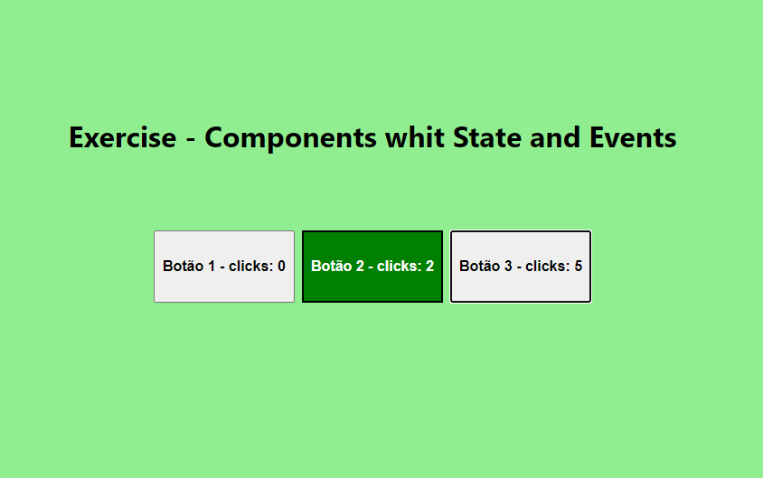

# Para Fixar - Exercícios do dia

### Parte 1
- Crie uma aplicação React com npx create-react-app fancy-buttons, que atenda ao seguinte critérios: O componente App.jsdeve ser alterado para que seja um componente de classe e contenha um botão associado a um evento que imprime um texto qualquer via console.log().

- Faça com que sua aplicação anterior exiba três botões lado a lado com textos diferentes. Cada botão clicado deve acionar um evento diferente, cada um escrevendo algo diferente no console do navegador via console.log().

### Parte 2
- Faça com que as funções criadas possuam acesso ao objeto this.

### Parte 3
- Agora você vai converter a aplicação desenvolvida nos exercícios anteriores para uma que conta o número de cliques dados em cada botão!

- Defina um estado inicial para a contagem de cada botão.

- Agora, quando um botão for clicado, altere de forma assíncrona o estado deste botão de zero para um.

- Por fim, incremente a contagem de um botão sempre que ele for clicado.

### Parte 4
- Defina uma lógica que estabeleça que, quando o número de cliques no botão for par, ele deve ser verde.

- Agora, ao clicar no botão, a sua cor atual deve ser impressa por meio de um console.log(). Essa lógica precisa ser implementada na mesma função utilizada para aumentar o contador de cliques dos botões.

